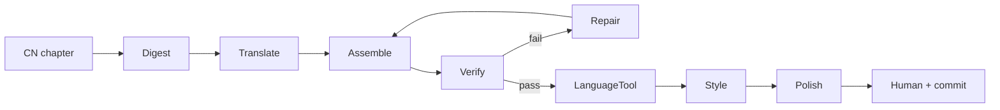

# Translation pipeline (`translate/`)

Machine-assisted ZH → registered locales (`ru`, `en`, `es`, `pt`; `vi` pilot). CN chapters stay at `book/NN-*.md`;
overlays land in `book/<lang>/`.

Site/OG/repo gates live in [`forge/`](../forge/README.md). Rituals (sync, add-chapter)
live in [`docs/pipeline/`](../docs/pipeline/).

| Package | Role |
|---|---|
| `translate/steps/` | conveyor: digest → translate → assemble → verify → repair → polish |
| `translate/lib/` | shared config / labels / paths |
| `translate/shelf/` | `style_check`, `readability`, `lt_check` (required LT after verify) |
| `translate/ops/` | `status`, `wave_pipeline`, `watchdog` |
| `translate/llm/` | Hy-MT2 client (`HTLB_LLM_*` → `:8080`) |
| `translate/laya/` | clarity for polish (`:8090`) |

Output dirs `translate/digest/` and `translate/runs/` are gitignored.

| Doc | Scope |
|---|---|
| [llm/README.md](llm/README.md) | Hy-MT2 / `llama-server` / `.env` |
| [languagetool/README.md](languagetool/README.md) | LT Docker `:8010` — required after verify |
| [laya/README.md](laya/README.md) | Laya `:8090` — required for polish |
| [../docs/pipeline/translation-playbook.md](../docs/pipeline/translation-playbook.md) | command notes |
| [../docs/pipeline/add-chapter.md](../docs/pipeline/add-chapter.md) | chapter checklist |
| [../TRANSLATION.md](../TRANSLATION.md) | conventions |

`make help` lists wrappers. **`make wave` = assemble + verify.**

---

## Flow

After green verify: `make lt` (LT must be up) → `make style` / `make quality` →
`make polish` (Laya + Hy-MT2). Repair only for `number_absent` / `banned_calque`.

| Step | Code | Writes |
|---|---|---|
| Digest | `steps/digest/make_digest.py` | `translate/digest/NN/` |
| Translate | `steps/translate/translate_unit.py` + `llm/client.py` | `translate/runs/active/<lang>/NN/` |
| Assemble | `steps/assemble/assemble.py` | `book/<lang>/` |
| Verify | `steps/verify/verify.py` | report only |
| Repair | `steps/repair/repair_wave.py` | dirty units → re-assemble |
| LanguageTool | `shelf/lt_check.py` (`make lt`) | report; exit 2 if `:8010` down |
| Style | `shelf/style_check.py` (`make style` / `make quality`) | report |
| Polish | `steps/polish/polish_wave.py` | plain-terms → re-assemble |
| Human | — | MR + squash |

Research CLIs under `validate/research/` are calibration only — not on this flow.

### Vietnamese pilot

See [docs/pipeline/vi-pilot.md](../docs/pipeline/vi-pilot.md) and the
[reviewed chapter 01 sample](../docs/pipeline/vi-ch01-pilot.md).
`vi` is explicitly unpublished (`publication: pilot` in `langs.json`).
Partial assembly/verification accepts `--items 1,2,3`; partial assembly into
`book/` is forbidden and verify requires `--file`, without completion stamps.
Default bulk waves/quality and ebook builds exclude unpublished pilots.
Vietnamese LT/readability gates are not configured; they return exit 2, not
success. Laya polish is not validated for Vietnamese yet.

---

## Blocks

### Digest / Translate / Assemble / Verify / Repair

See prior ops docs: [llm/README.md](llm/README.md). Workdir = parent of `units/`
(`translate/runs/active/<lang>/<NN>`). Verify HARD: counts, tags, sources, numbers/calques.
Repair: ≤8 dirty/round, ≤3 rounds; `--dry-locate`.

### LanguageTool — `translate/shelf/lt_check.py`

| | |
|---|---|
| **Runtime** | `make lt CH=NN LANG=ru` → HTTP `:8010` |
| **In → out** | plain-terms lines → WARN grammar hits |
| **Exit** | `0` LT answered · `2` server down / unreachable with lines to check |
| **Needs** | [languagetool/README.md](languagetool/README.md) |

### Style — `translate/shelf/style_check.py`

| | |
|---|---|
| **Runtime** | `make style` / `make quality` (`--book --strict`) |
| **Why** | Markers from `translate/rules/<lang>.json` |

### Polish — `translate/steps/polish/polish_wave.py`

| | |
|---|---|
| **Runtime** | Laya clarity + Hy-MT2 simplify |
| **Exit** | `0` понятно or leftover list · `1` `RUN_REPAIR` · `2` Laya down |
| **Needs** | Laya `:8090` + Hy-MT2 `:8080` |

### Human + commit

Tone, titles, Cost tags, ES parity by eye. Overlay only via MR + squash to `main`.

---

## What to start

| Need | How |
|---|---|
| Python ≥ 3.11 venv | repo root; `PYTHONPATH=.` or `make …` |
| Hy-MT2 | [llm/README.md](llm/README.md) — GGUF + `llama-server` `:8080`, `.env` `HTLB_LLM_*` |
| LanguageTool | Docker `:8010` before `make lt` |
| Laya | `./translate/laya/start-laya-server.sh` before `make polish` |

Workdirs under `translate/runs/` / `translate/digest/` are local. Publication is `book/<lang>/` + `translations.json` via MR.
